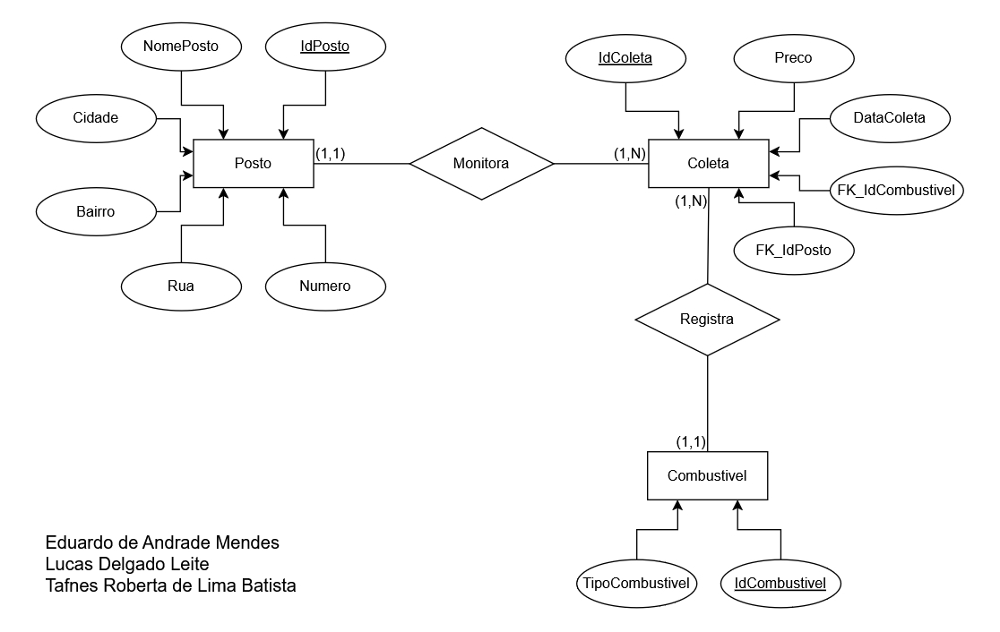
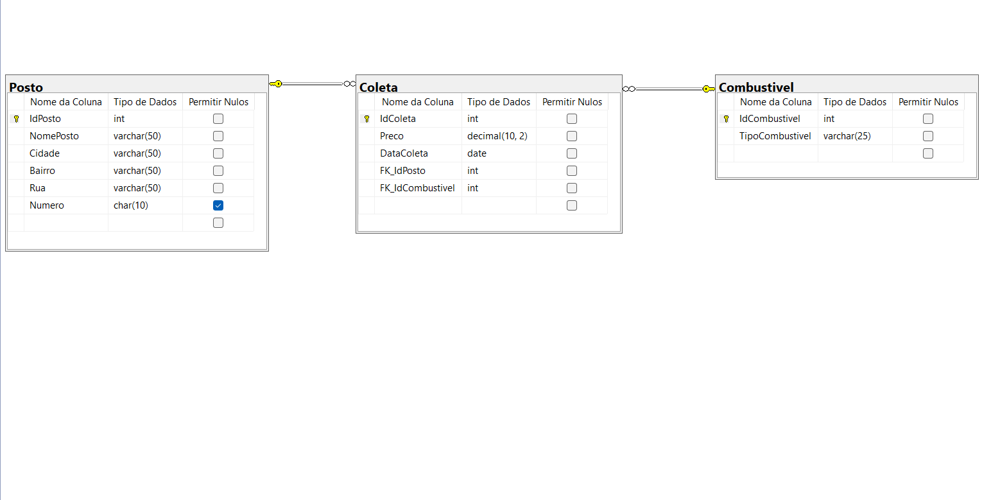
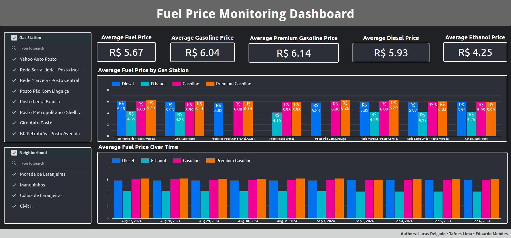

# Fuel Price Monitoring

> Complete SQL Server database project featuring relational modeling, data import, analytical queries, and dashboard visualization.


---

## Overview

This project implements a complete relational database solution for monitoring fuel prices collected from gas stations located in **Serra, Espírito Santo, Brazil**.

The project covers the entire database development lifecycle, including conceptual modeling, relational design, normalization, SQL Server implementation, CSV data import, analytical SQL objects, and interactive dashboard visualization using Looker Studio.

---

## Features

- Relational database modeled in **Third Normal Form (3NF)**
- Conceptual and physical database design
- SQL Server implementation
- CSV data import using **OPENROWSET**
- XML format file for bulk data loading
- Analytical View for reporting
- Stored Procedures with optional filtering parameters
- Interactive dashboard developed in **Looker Studio**

---

## Database Design

The database was designed following a structured modeling process, from the conceptual model to the physical implementation.

### Conceptual Model

<p align="center">
  
</p>

---

### Physical Model

<p align="center">
  
</p>

The relational model consists of three entities:

- **Posto** – Stores gas station information.
- **Combustivel** – Stores the available fuel types.
- **Coleta** – Stores daily fuel price collections.

---

## Dashboard

The collected fuel price data is presented through an interactive dashboard developed in **Looker Studio**.

<p align="center">
  
</p>

The dashboard allows users to:

- Compare average fuel prices
- Filter data by gas station
- Filter data by neighborhood
- Analyze fuel price trends over time

---

## Project Structure

```text
fuel-price-monitoring/
│
├── data/
│   ├── fuel_price_collection.csv
│   └── fuel_price_format.xml
│
├── database/
│   ├── 01_schema.sql
│   ├── 02_seed_data.sql
│   ├── 03_data_import.sql
│   ├── 04_views.sql
│   └── 05_procedures.sql
│
├── design/
│   ├── conceptual_model.jpg
│   └── er_diagram.png
│
├── dashboard/
│   └── dashboard_overview.png
│
└── README.md
```

---

## Technologies

- SQL Server
- SQL Server Management Studio (SSMS)
- Looker Studio

---

## Getting Started

### Prerequisites

- SQL Server
- SQL Server Management Studio (SSMS)

---

### Database Setup

Execute the scripts in the following order:

```text
01_schema.sql

↓

02_seed_data.sql

↓

03_data_import.sql

↓

04_views.sql

↓

05_procedures.sql
```

After executing the scripts, the database will be fully configured and ready for querying and dashboard visualization.

---

## Stored Procedures

| Procedure | Description |
|------------|-------------|
| `sp_menorpreco` | Returns the lowest recorded fuel price for each fuel type with optional neighborhood and fuel filters. |
| `sp_precomedio` | Calculates the average fuel price by neighborhood with optional date filtering. |
| `sp_resumopostos` | Returns a summary of each gas station, including the number of price records and the average fuel price within a specified period. |

---

## View

| View | Description |
|------|-------------|
| `vw_MonitoramentoCombustiveis` | Combines fuel price collections with gas station and fuel information for reporting and dashboard visualization. |

---

## Authors

- Lucas Delgado
- Tafnes Lima
- Eduardo Mendes
